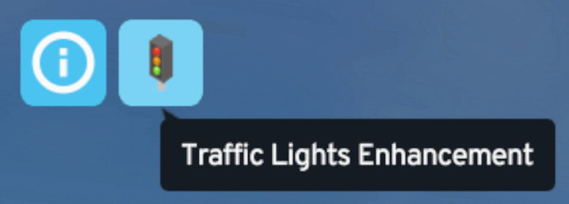

# Traffic Lights Enhancement Guide

## What This Mod Does

TLE Extended lets you change how individual traffic lights behave in Cities: Skylines II. Open the tool, select a signalized intersection, choose the signal behavior you want, and save it.

You can use it to:

- Choose a built-in signal mode for an intersection.
- Add options such as turning on red or a dedicated pedestrian phase.
- Build your own custom phase cycle.
- Give trams or buses signal priority at selected intersections.

The mod supports both left-hand traffic and right-hand traffic. It is also intended to keep existing Traffic Lights Enhancement intersection settings compatible when you load a city with TLE Extended.

> [!TIP]
> If a mode or option is missing, the selected intersection probably cannot use it. Try a simpler road junction, or use Custom Phases if you want to build the signal behavior yourself.

## How To Use

1. Select the Traffic Lights Enhancement button from the top-left toolbar.



2. The Traffic Lights Enhancement panel opens. Click a signalized intersection once to select it.


3. Choose the signal mode and options you want. Enable Transit Signal Priority only for intersections where trams or buses should get help from the light.


4. Click Save. The selected intersection should now use those settings.

## Choosing A Signal Mode

Signal modes decide which lanes get green lights together and how the signal moves through its cycle. A lane group is just a set of lanes that turns green at the same time.

| Mode | What it does |
| --- | --- |
| Vanilla | Uses the base-game style signal behavior. This is the safest starting point if you only want small option changes. |
| Split Phasing | Gives one direction or lane group a green light at a time. This can make busy turning movements easier to control, but it may also make the full cycle longer. |
| Protected Left-Turns / Protected Right-Turns | Adds a separate protected turn before normal traffic flow. In right-hand traffic, the UI shows Protected Left-Turns. In left-hand traffic, it shows Protected Right-Turns. |
| Split Phasing + Protected Left | A split-phasing variant that also gives protected left turns when the intersection layout supports it. |
| Custom Phases | Lets you build the signal cycle yourself by deciding which lanes and crossings are green in each phase. This is powerful, but easier to misconfigure. |

Some modes only appear for simple road intersections. Protected turn modes need a normal four-way intersection where traffic can continue straight ahead from each side. Split-phasing modes are hidden on intersections with more than seven connected road or track segments, and at crossings where train tracks or tram-only tracks cross the road.

## Extra Options

These options appear when the selected mode and intersection layout support them.

| Option | What it does |
| --- | --- |
| Allow Turning on Red | Lets vehicles make the curbside turn on red: right turns in right-hand traffic, left turns in left-hand traffic. |
| Give Way to Oncoming Vehicles | Vanilla mode only. Turning vehicles should yield to oncoming traffic, though aggressive drivers may still reduce how well this works at busy junctions. |
| Exclusive Pedestrian Phase | Adds a separate pedestrian phase where vehicle traffic stops while crossings are served. |
| Pedestrian Phase Duration | Changes how long the exclusive pedestrian phase lasts. Treat this as a multiplier: larger values mean a longer pedestrian green. Pedestrian lights do not automatically extend when more pedestrians are waiting. |

> [!WARNING]
> Some pedestrian pathfinding problems appear to come from the game's node or pathfinding behavior. This mod can control signal phases, but it cannot fix every pedestrian routing issue at unusual junctions.

## Custom Phases

Custom Phases are for intersections where the built-in modes are not enough. A phase is one step in the traffic-light cycle. For each phase, you choose which lanes, tram tracks, bike lanes, and crosswalks are allowed to move.

The custom phase editor has two timing styles:

| Timing style | What it means |
| --- | --- |
| Dynamic | The signal reacts to measured traffic demand. Empty or low-demand phases can be skipped when their settings allow it. |
| Fixed Timed | The signal follows the phase order and timing more directly. Smart Phase Selection can still choose phases based on demand when enabled. |

Timing templates are starting points for the phase settings. They adjust timing values for every custom phase; they do not inspect which phase serves cars, pedestrians, or tracks. For example, Quick Cycle uses shorter timings, Heavy Traffic uses longer timings, Pedestrian Friendly uses a more balanced timing preset, Rail Priority uses a preset intended for track-heavy custom cycles, and Night Mode uses very short timings that skip empty phases more readily.

The duration controls are best treated as relative timing values, not exact real-world seconds. Bigger values make phases run longer.

## Transit Signal Priority

Transit Signal Priority, or TSP, lets a selected intersection favor approaching transit vehicles. It is configured separately for every intersection.

| Source option | What it does |
| --- | --- |
| Enable for trams | Allows approaching trams to request priority. Tram priority is stronger and can move the signal toward a tram-serving phase when the controller can do so safely. |
| Enable for buses | Allows approaching buses to request soft priority. Bus priority can hold a matching green or choose the bus-serving group at normal transition points, but it is less aggressive than tram priority. |

TSP is meant to reduce avoidable transit delay. It does not guarantee that every bus or tram gets an instant green light.

Trams have higher priority than buses. Buses are handled more carefully because they may be boarding, stopping before the light, sharing mixed traffic lanes, or changing lanes. Dedicated bus lanes usually give cleaner detection, but mixed-lane buses are supported when the detector can identify a safe target.

TSP also respects pedestrian protection. If an exclusive pedestrian phase is active or due, the mod may delay or ignore a transit request so pedestrians are not starved.

## Traffic Groups And TSP

Traffic groups coordinate multiple intersections, usually for green waves. TSP and traffic groups are intentionally treated as incompatible controls.

When an intersection is part of a traffic group, local TSP is paused for that intersection, including the group leader. This lets the group timing stay in charge. The intersection's saved TSP settings are kept, so they can work again if you remove the intersection from the group.

## Diagnostics

Most players can ignore diagnostics. They are mainly for testing, bug reports, and figuring out why a bus or tram did or did not receive priority.

To use them, enable the TSP diagnostics option in the mod settings, then select an intersection. The selected-intersection panel can show live TSP state and recent decisions. The same diagnostics feature writes JSONL trace lines with extra details for troubleshooting.

On Windows, the active trace file is written to:

```text
C:\Users\<your user name>\AppData\LocalLow\Colossal Order\Cities Skylines II\C2VM.TrafficLightsEnhancement.TspDiagnostics.jsonl
```

When the file reaches 5 MB, the mod rotates it in the same folder with a timestamped name such as `C2VM.TrafficLightsEnhancement.TspDiagnostics.20260527091530.jsonl`. It keeps the active file plus the newest three rotated files.

### Common Diagnostics Fields

| Field | What it means |
| --- | --- |
| Enabled | Whether TSP is enabled for the selected intersection. |
| Signal state | What the signal controller is currently doing, such as ongoing, ending, changing, beginning, extending, or extended. |
| Current group | The lane group currently receiving service. |
| Next group | The lane group the controller is preparing to serve next. `-` means no next group is selected yet. |
| Timer | The current signal timer value. |
| Signal groups | How many lane groups the selected intersection has. |
| Request | The active TSP request. `Early` means a fresh approaching vehicle was detected. `Latched` means a recent request is being held briefly after the sample disappeared. `None` means there is no active request. |
| Source | The request source, usually `Track` for trams or `Bus` for bus TSP. |
| Target group | The lane group the transit vehicle wants served. |
| Strength | The request strength used when more than one TSP request competes. |
| Expiry | How long a latched request can remain active before clearing. |
| Extend current phase | Whether the request can hold the current green because it already serves the transit vehicle. |
| Decision | The final TSP decision, such as extending the current phase, selecting the target phase, or waiting. |
| Base group | The group the signal would have served before TSP was considered. |
| Selected group | The group selected after TSP was considered. |
| Decision target | The group requested by the TSP decision being considered. |
| Decision source | Whether the decision came from a tram/track request or a bus request. |
| Exclusive pedestrian phase | Whether exclusive pedestrian phasing is enabled when pedestrian context affects the TSP decision. |
| Active pedestrian protection | Whether an active pedestrian phase is being protected from preemption. |
| Pedestrian phase due | Whether a waiting pedestrian phase may delay TSP so pedestrians are not starved. |
| Recent TSP events | A short history of recent request and decision changes. The newest event appears first. |

### Bus Diagnostics

| Field or decision | What it means |
| --- | --- |
| Bus probe | How the bus detector matched the sampled bus to the intersection. |
| Bus decision | The bus detector outcome. This explains whether a bus request was emitted or why it was suppressed. |
| Bus target group | The lane group matched to the sampled bus. |
| Bus hits | Number of bus samples contributing to the selected match. |
| Bus lane type | Whether the sampled bus is in a mixed lane or bus-only lane. |
| Bus lane change | Whether the sampled bus appears to be changing lanes. |
| Bus speed | The sampled bus speed. |
| Request emitted | A bus sample was eligible and generated a TSP request. |
| No eligible bus sample | No current bus sample met the detector and eligibility rules. |
| Bus priority disabled | Bus TSP is disabled at this intersection. |
| Suppressed: boarding | The bus appears to be stopped and boarding passengers. |
| Suppressed: near-side stop | Reserved for stop-aware detection. If shown, the bus is expected to stop before the signal, so holding the light would not help. |
| Suppressed: stop relation unknown | The stop relationship could not be determined safely. |
| Suppressed: lane change ambiguous | The bus appears to be changing lanes, so the target group may be unreliable. |

Some diagnostics rows use internal lane IDs, owner IDs, sample counts, curve positions, or fallback counts. These are not gameplay controls. They exist so trace logs and the colored lane overlay can be compared when investigating a problem.
